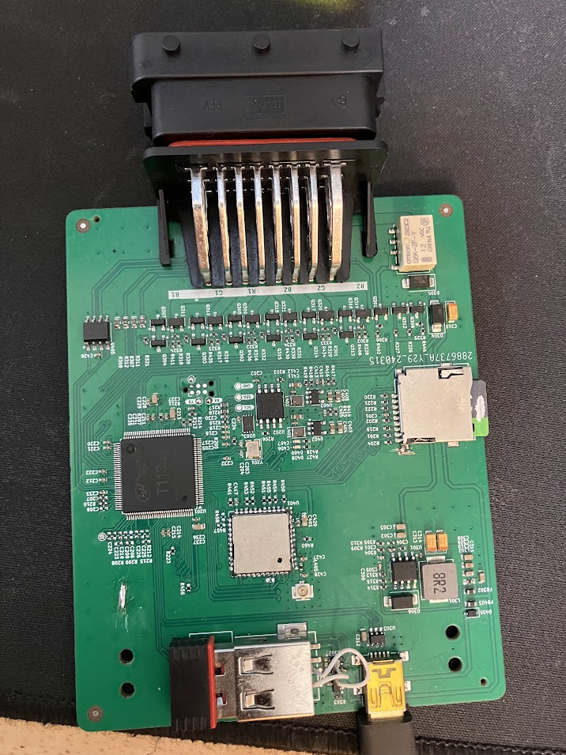

# ConeRGB Underglow3 Nerves Support

This is the base Nerves System configuration for [ConeRGB V3](https://github.com/connorrigby/underglow3).

| Feature              | Description                     |
| -------------------- | ------------------------------- |
| CPU                  | 1.2 GHz ARM Cortex-A7 Dual-Cor  |
| Memory               | 128 MB DDR3                     |
| Storage              | MicroSD                         |
| Linux kernel         | 6.1 w/ patches                  |
| IEx terminal         | UART `ttyS0`                    |
| GPIO, I2C, SPI       | Yes - [Elixir Circuits](https://github.com/elixir-circuits) |
| Display              | No                              |
| ADC                  | No                              |
| PWM                  | 8 channels                      |
| UART                 | ttyS0                           |
| Camera               | No                              |
| Ethernet             | No                              |
| WiFi                 | Onboard WiFi                    |
| RTC                  | No                              |
| HW Watchdog          | Yes                             |

## Special Thanks

Most of the hard work in this repo was gleamed from [YuzukiSBC](https://github.com/YuzukiHD/Buildroot-YuzukiSBC)
